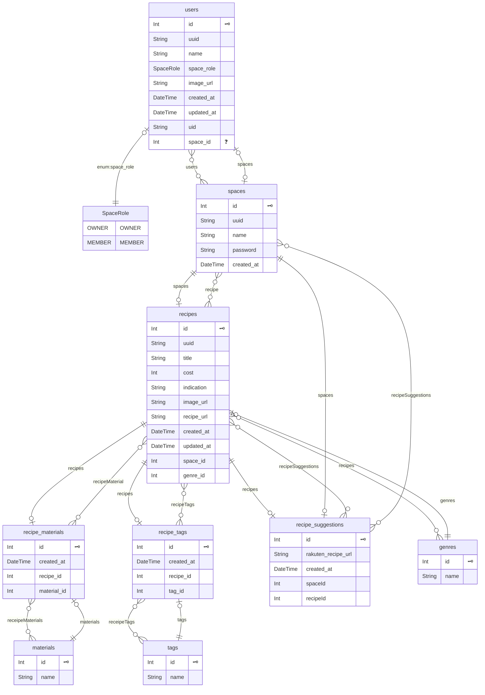

```mermaid
erDiagram

        SpaceRole {
            OWNER OWNER
MEMBER MEMBER
        }
    
  "users" {
    Int id "🗝️"
    String uuid 
    String name 
    SpaceRole space_role 
    String image_url 
    DateTime created_at 
    DateTime updated_at 
    String uid 
    Int space_id "❓"
    }
  

  "spaces" {
    Int id "🗝️"
    String uuid 
    String name 
    String password 
    DateTime created_at 
    }
  

  "recipes" {
    Int id "🗝️"
    String uuid 
    String title 
    Int cost 
    String indication 
    String image_url 
    String recipe_url 
    DateTime created_at 
    DateTime updated_at 
    Int space_id 
    Int genre_id 
    }
  

  "recipe_materials" {
    Int id "🗝️"
    DateTime created_at 
    Int recipe_id 
    Int material_id 
    }
  

  "recipe_tags" {
    Int id "🗝️"
    DateTime created_at 
    Int recipe_id 
    Int tag_id 
    }
  

  "materials" {
    Int id "🗝️"
    String name 
    }
  

  "tags" {
    Int id "🗝️"
    String name 
    }
  

  "recipe_suggestions" {
    Int id "🗝️"
    String rakuten_recipe_url 
    DateTime created_at 
    Int spaceId 
    Int recipeId 
    }
  

  "genres" {
    Int id "🗝️"
    String name 
    }
  
    "users" o|--|| "SpaceRole" : "enum:space_role"
    "users" o|--|o "spaces" : "spaces"
    "spaces" o{--}o "users" : "users"
    "spaces" o{--}o "recipes" : "recipe"
    "spaces" o{--}o "recipe_suggestions" : "recipeSuggestions"
    "recipes" o|--|| "spaces" : "spaces"
    "recipes" o|--|| "genres" : "genres"
    "recipes" o{--}o "recipe_materials" : "recipeMaterial"
    "recipes" o{--}o "recipe_tags" : "recipeTags"
    "recipes" o{--}o "recipe_suggestions" : "recipeSuggestions"
    "recipe_materials" o|--|| "recipes" : "recipes"
    "recipe_materials" o|--|| "materials" : "materials"
    "recipe_tags" o|--|| "recipes" : "recipes"
    "recipe_tags" o|--|| "tags" : "tags"
    "materials" o{--}o "recipe_materials" : "receipeMaterials"
    "tags" o{--}o "recipe_tags" : "receipeTags"
    "recipe_suggestions" o|--|| "spaces" : "spaces"
    "recipe_suggestions" o|--|| "recipes" : "recipes"
    "genres" o{--}o "recipes" : "recipes"
```
